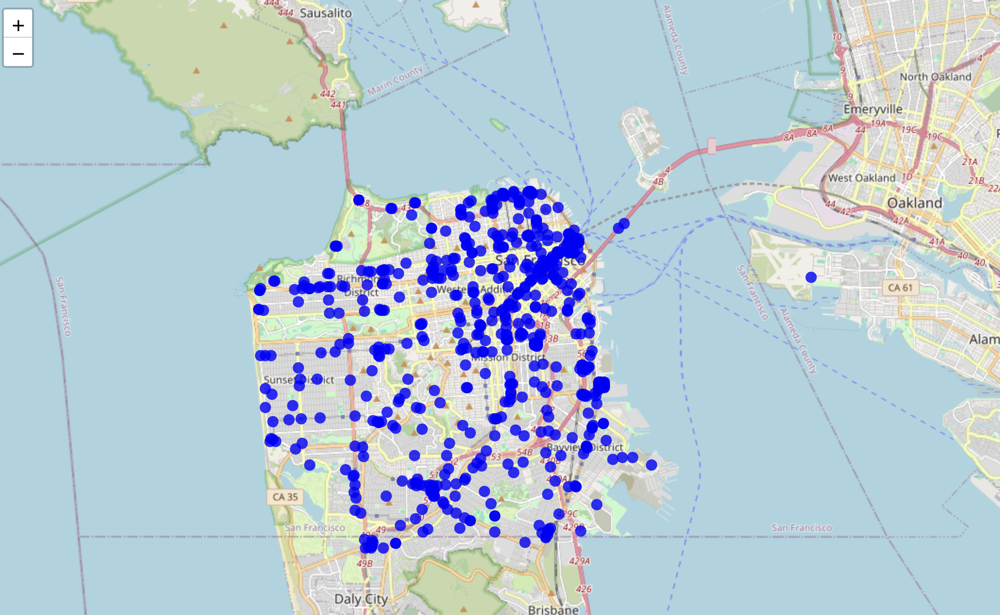

# SF Muni Real Time Display
See the real time position of SF Muni vehicles displayed on a map of The Bay. You'll see references to the LA metro throughout this file because I orginally wanted to do this for LA but they make it difficult to get developer access so I pivoted to the Bay.

## Prerequisites.
You need an API key from 511 SF Bay. You can request a key [here](https://511.org/open-data/token). Once you have a token, add it to your local environment. For example, on my MacBook I added this to  `~/.zshrc`:
```
export BART_API_KEY=YOUR_KEY
```

## How to Run.
You'll need to open two terminals. In one, navigate to `./backend` and run:
```
mvn spring-boot:run
```

In the other terminal, navigate to `./frontend` and run:
```
npm run dev
```

## Snapshot
Navigating to http://localhost:5173/:
